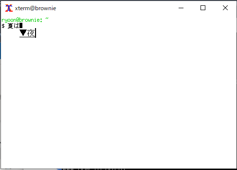

# VcXsrv with Windows Input Method Editor to XIM

This enables inputing Japanese characters to X applications
with Windows Input Merhod Editor (IME) via X Input Method (XIM).

```
$ set XMODIFIERS=@im=XIME
$ export XMODIFIERS
$ set LIBGL_ALWAYS_INDIRECT=1
$ export LIBGL_ALWAYS_INDIRECT
$ xterm &
$ firefox &
```



## How to build

### Requirements

* Git for Windows
* Cygwin 3.3 (with 3.4, Strawberry Perl fails silently)
  * Packages: bison, flex, gawk, gperf, gzip, nasm, sed, python27, python38, python38-lxml
* Visual Studio Community 2022
* Strawberry Perl Portable edition
  * Install under C:\perl
* Python 3.9 for Windows
  * Install under c:\Python39
  * Packages: lxml, mako

### How to build
In Git for Windows's Git Bash window:
XXX: To avoid a short path name problem, use `vcxsrv` as directory name.
```
> mkdir /c/repos/vcxsrv
> cd /c/repos/vcxsrv
> git init
> git config core.autocrlf false
> git remote add origin git@github.com:ryoon/vcxsrv-winime.git
> git pull origin winime-xim
> git switch winime-xim
```

In Cygwin Terminal:
```
> cd /dygdrive/c/vcxsrv
> export SHELLOPTS
> set -o igncr
> ./buildall.sh 1 5 R
```

x86_64 release build will begin.

You will get `vcxsrv-64.1.20.14.0.installer.exe`
in `xorg-server/installer/`.
Run and install it.

## How to run

Create the Windows shortcut as follows:
```
"C:\Program Files\VcXsrv\vcxsrv.exe" -multiwindow -clipboard -noprimary -wgl -xkblayout us
```

## Known issues
* The first character will be dropped.
* It seems that Ctrl key is always as pushed in some cases.


# How to download
[vcxsrv-64.1.20.14.0-winime.installer-20230612.exe](https://www.ryoon.net/~ryoon/vcxsrv-winime/vcxsrv-64.1.20.14.0-winime.installer-20230612.exe)


# Acknowledgments
Great thanks to the original author, zakki.
You can get the original patches from [peppermint.jp](http://www.peppermint.jp/products/asis/).
